# CSC412 Week 9 Lecture Notes
#### Organized by: Griffin Yacynuk
The following lecture notes are based upon the week 9 lecture from CSC412: VAEs. They have been augmented with additional content from previous lectures, as well as with Diederik Kingma's thesis paper, Variational Inference & Deep Learning: A New Synthesis. Furthermore, it should be noted that all included artwork is original. Finally, please view this with the Github light theme for maximum visibility of embedded formulae.

## Probabilistic Modelling
Let's start by assuming we have some dataset of observed variables 𝐗, |𝐗| = N, where each sample 𝑥 𝛜 𝐗 is independent and identically distributed according to some true distribution, p*(𝑥), that is unknown to us. Our goal is to build a probabilistic model, pθ(𝑥), that approximates this true distribution.

To restate this goal with more mathematical rigour, our objective is to _maximize the likelihood_ of our observed data 𝐗 under our model pθ(𝑥). In this optimization problem we typically consider our dataset to be fixed, and thus the likelihood ℓ has a functional dependance on our model parameters θ only. Since we assumed our dataset to be i.i.d., our likelihood function is as follows:

<!-- $$
\ell(\theta) = \prod_{i=1}^N p_\theta (x^{(i)})
$$ --> 

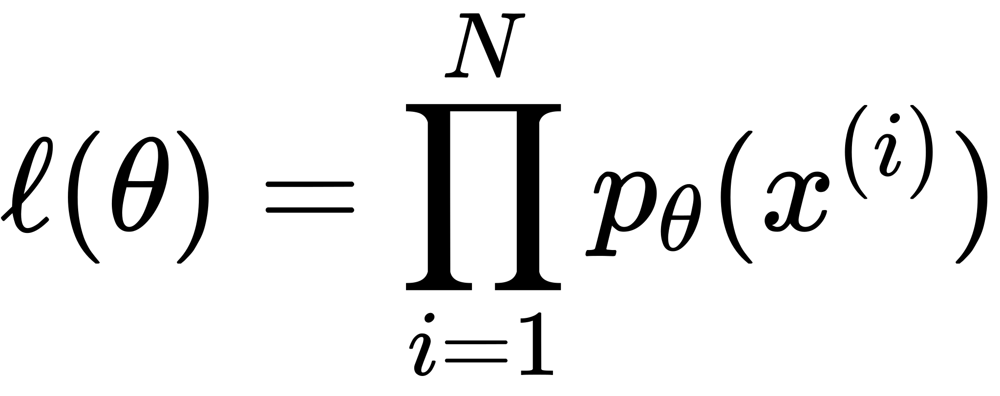
 

Due to numerical stability issues that arise when working with very small probabilities, we typically work with _log probabilities_ instead. The strict monotonicity of the _log_ function ensures that p(𝑥) > p(𝑦) ⇔ _log_ p(𝑥) > _log_  p(𝑦). Since the product of probabilities corresponds to the addition of log-probabilities in logarithmic space, our log-likelihood function is:

<!-- $$
log(\ell(\theta)) = \sum_{i=1}^N log(p_\theta (x^{(i)})) \tag{1}
$$ --> 

 

A common modelling choice when building a probabilistic model is to introduce _latent variables_. Such variables are unobserved, and thus do not come from the dataset, and are simply used as a modelling tool. We'll denote these latent variables as 𝐙, and will assume that they are continuous, ∀ 𝑧 𝛜 𝐙, 𝑧 𝛜 ℝ. Expressed as a directed graphical model, we have:

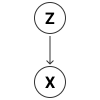

Therefore we can factorize the joint distribution of our observed data and our latent variables as follows:

<!-- $$
\begin{align*}
p_\theta (x, z) &= p_\theta (z) p_\theta (x | z)\\
\Rightarrow log (p_\theta (x, z)) &= log (p_\theta (z)) + log (p_\theta (x | z))
\end{align*}
$$ --> 

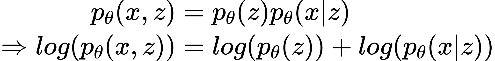
 

However, this introduction of continuous latent variables has now made our optimization goal intractable: pθ(𝑥) is now a marginal distribution, and to compute it we need to marginalize out our latent variables:

<!-- $$
p_\theta (x) = \int p_\theta (x, z) dz
$$ --> 

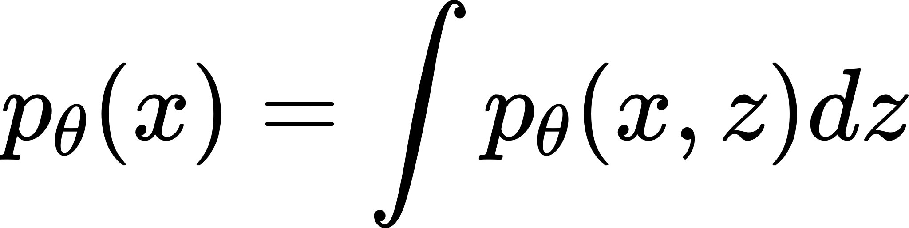
 

But no closed form solution exists for this equation, nor does an efficient estimator. Thus the intractability of pθ(𝑥) also results in the posterior distribution pθ(𝑧|𝑥) being intractable as well:

<!-- $$
p_\theta (z|x) = \frac{p_\theta (x, z)}{p_\theta (x)}
$$ --> 

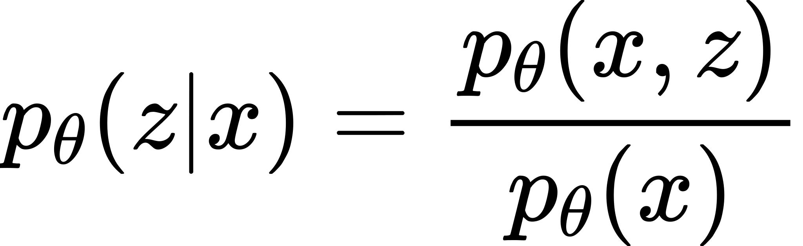
 

To overcome this, we will approximate the posterior pθ(𝑧|𝑥) with the variational distribution qφ(𝑧|𝑥), which is parameterized by its own unique parameter φ. This variational parameter φ will be learned using a _variational auto encoder_ (VAE). But before continuing with this topic, let us take a brief digression to talk about _auto encoders_ in general.

## Auto Encoders
An auto encoder is a feed forward neural network that takes some vector 𝐱 as input, and then tries to output the same vector 𝐱. To make the problem non-trivial, a _bottleneck layer_ is introduced, whose dimensionality is far lesser than that of the input. This forces the network to learn how to embed the input into a lower dimension, whilst retaining as much detail as possible. We denote all layers between the input layer and the bottleneck layer (inclusive) as the _encoder_, and all layers between the bottleneck layer and the output layer (inclusive) as the _decoder_. The vector produced at the bottleneck layer is called the _code vector_. Pictured below we see the architecture of the simplest auto encoder, containing only a single hidden layer. This auto encoder embeds a 12-dimensional input vector into a 2-dimensional code vector.

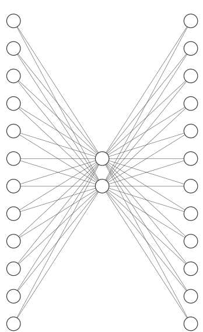

Let's consider the case when all layers have linear activation functions, and we used squared error as our loss function. Let 𝐔 be a 2x12 matrix representing the encoder, and 𝐕 be a 2x12 matrix representing the decoder. Then given an input vector 𝐱, our auto encoder produces a _reconstruction_ of 𝐱 as follows:

<!-- $$
\begin{align*}
\widetilde{x} &= VUx\\
\mathcal{L}(x, \widetilde{x}) &= ||x - \widetilde{x}||^2 
\end{align*}
$$ --> 

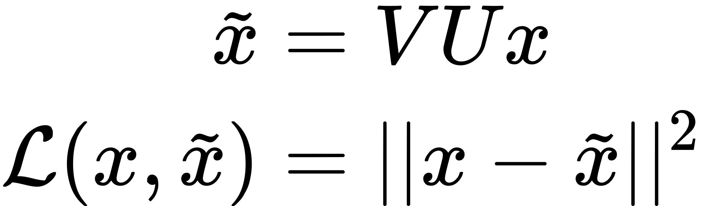
 

This auto encoder actually results in a linear function, since matrix multiplication is associative:

<!-- $$
\begin{align*}
\widetilde{x} &= VUx\\
&= (VU)x
\end{align*}
$$ --> 

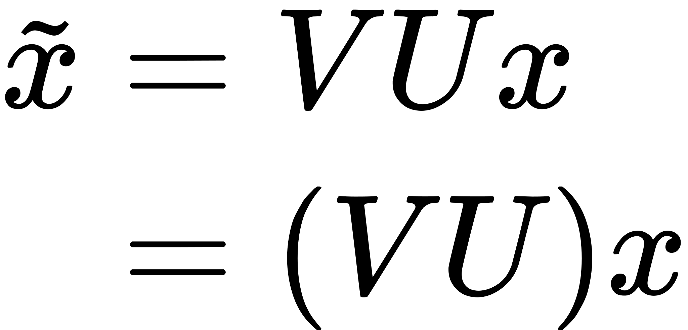
 

which when optimized using squared error loss, results in an encoder that is equivalent to that obtained when performing principal component analysis. This is because finding the code vector subspace that minimizes the loss (reconstruction error) is equivalent to finding the subspace that maximizes the projected variance.

In order to produce more accurate reconstructions, instead of mapping to a linearly to a code vector subspace, we can utilize deep neural networks to learn a nonlinear projection of the data onto a nonlinear manifold instead. This can be accomplished by adding some nonlinear activation function after each of our layers, and then learning weights iteratively (for instance through SGD).

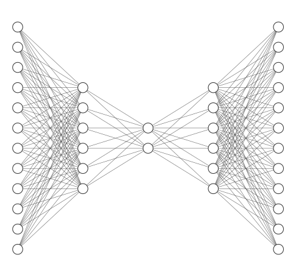

Deep nonlinear auto encoders are powerful, and the code vectors they learn are far more expressive than those created by linear auto encoders. However, these models cannot be used in any generative capacity. The reason is twofold:
 - Firstly, the input is _deterministically_ projected into the nonlinear manifold, resulting in a likely sparse and discontinuous manifold. Therefore, assuming we had some way to "sample" from this manifold, the resulting reconstruction will likely be from a degenerative case, and not resemble anything from the input space.
 - Secondly, since our projection is deterministic, even if two inputs are "close" by some distance measure, we have no guarantee that their code vectors will be close. Therefore the manifold does not represent a distribution of any sort! Very similar inputs may be mapped to completely different code vectors, and very different inputs may be mapped to very close code vectors (illustrated below).

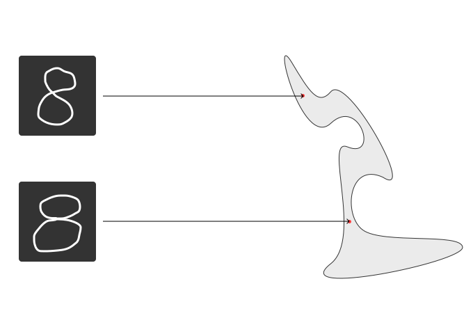

## Variational Auto Encoders
Let's recall our probabilistic model pθ(𝑥) from an earlier section. Furthermore, recall that we wanted to approximate the intractable posterior pθ(𝑧|𝑥) with a variational distribution qφ(𝑧|𝑥). To do so, we will use a VAE which learns to map input vectors 𝑥 𝛜 𝐗 to settings of the parameter φ. In effect, the encoder of the VAE now learns to map inputs 𝑥 to a _distribution_.

<!-- $$
enc(x) = \phi
$$ --> 

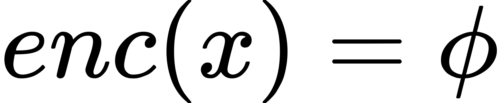
 

Now we can use this setting of the parameter φ to parameterize our variational distribution qφ(𝑧|𝑥). Since we know the value of φ, we can now sample from the variational distribution:

<!-- $$
\widetilde{z} \sim q_\phi (z | x)
$$ --> 

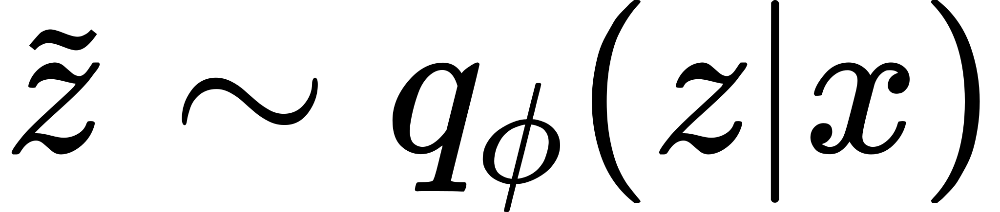
 

Finally, we can use this sample of our latent variables to reconstruct a sample from the input distribution:

<!-- $$
\widetilde{x} \sim p_\theta (x | \widetilde{z})
$$ --> 

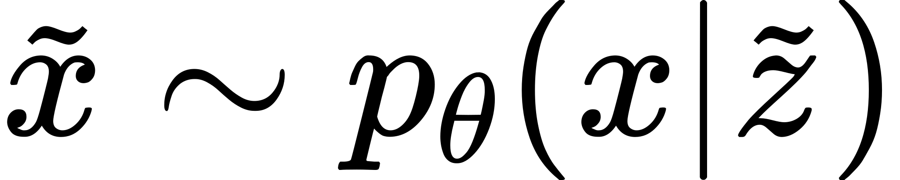
 

Notice that since our encoder now learns a _stochastic_ mapping from our observed data space 𝐗 to a latent variable 𝐙-space. By defining a prior over 𝐙 we can ensure its distribution is fairly simple, and thus easy to sample from (perhaps a factored Gaussian). The stochastic nature of the model introduces inherit noise, something that was not present in the previously discussed deterministic flavour of auto encoders. This noise forces model to map "close" latent variables to "close" reconstructions. Furthermore, this results in "close" inputs being mapped to similar distributions for the same reasons. All together, this means we can now sample from the latent distribution 𝐙, and use this sample with the decoder to "reconstruct" an element from the input space, thus resulting in a generative model.

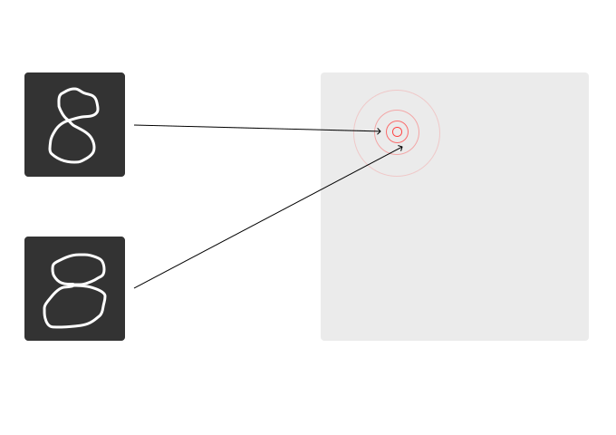
 

### Learning Objective
To learn the model, we need an objective function. In the following derivations, we will prove that maximizing the evidence lower bound is both tractable, and equivalent to maximizing the log-likelihood of our dataset 𝐗 under our model pθ(𝑥).

<!-- $$
\begin{align*}
log(p_\theta (x)) &= \mathbb{E}_{z \sim q_\phi (z | x)} [log(p_\theta (x))]\\
&= \mathbb{E}_{z \sim q_\phi (z | x)} [log(\frac{p_\theta (x, z)}{p_\theta (z|x)})]\\
&= \mathbb{E}_{z \sim q_\phi (z | x)} [log(\frac{p_\theta (x, z)}{q_\phi (z | x)} \frac{q_\phi (z | x)}{p_\theta (z|x)})]\\
&= \mathbb{E}_{z \sim q_\phi (z | x)} [log(\frac{p_\theta (x, z)}{q_\phi (z | x)})] + \mathbb{E}_{z \sim q_\phi (z | x)} [log( \frac{q_\phi (z | x)}{p_\theta (z|x)})]\\
&= \mathbb{E}_{z \sim q_\phi (z | x)} [log(p_\theta (x, z)) - log(q_\phi (z | x))] + D_{KL} (q_\phi (z|x) || p_\theta (z|x))
\end{align*}
$$ --> 

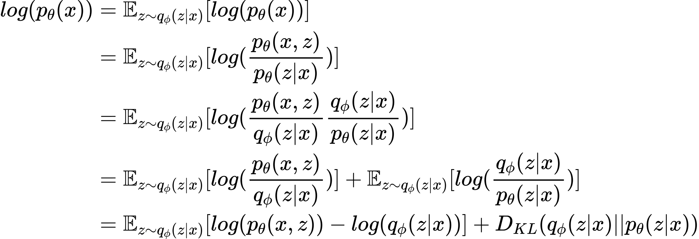
 

Since we know that a property of KL divergences is that they are always nonnegative, we have the following inequality:

<!-- $$
\begin{align*}
log(p_\theta (x)) &= \mathbb{E}_{z \sim q_\phi (z | x)} [log(p_\theta (x, z)) - log(q_\phi (z | x))] + D_{KL} (q_\phi (z|x) || p_\theta (z|x))\\
&\geq \mathbb{E}_{z \sim q_\phi (z | x)} [log(p_\theta (x, z)) - log(q_\phi (z | x))]
\end{align*}
$$ --> 

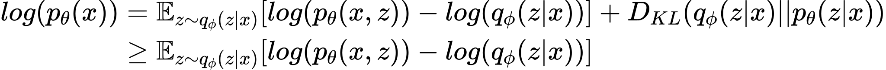
 

This lower bound is called the Evidence Lower BOund (ELBO), and notice that it is specifically the lower bound on the log-probability of our data. Recalling the log-likelihood function from equation 1, it should now be clear that maximizing the ELBO will also maximize the log-likelihood of our observed dataset 𝐗. Therefore the ELBO is a good candidate for our loss function when training the VAE.

<!-- $$
\mathcal{L}_{\phi, \theta} (X) = \mathbb{E}_{z \sim q_\phi (z | x)} [log(p_\theta (x, z)) - log(q_\phi (z | x))]
$$ --> 

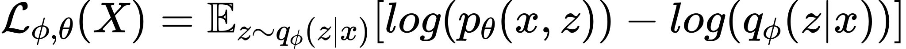
  

Given our entire dataset 𝐗 (which we initially assumed contained i.i.d. data points drawn from some true distribution p*(𝑥)), the loss is calculates as:

<!-- $$
\mathcal{L}_{\phi, \theta} (X) = \sum_{i=1}^{N} \mathcal{L}_{\phi, \theta} (x^{(i)})
$$ --> 

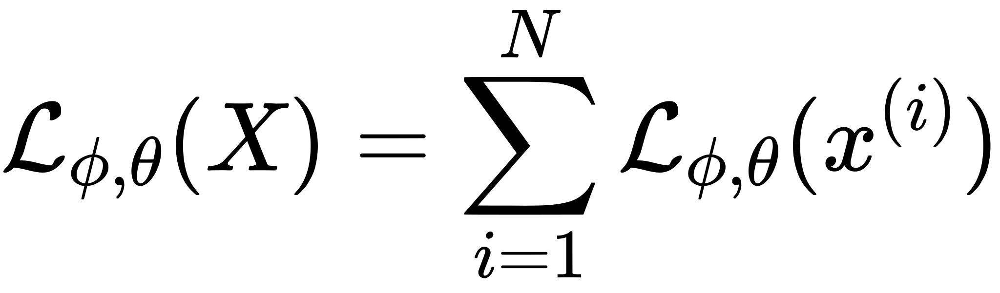
 

While the individual-datapoint ELBO is intractable (and thus so is computing its gradient), we will derive a good unbiased estimator of the gradient with respect to the _model_ parameters θ instead:

<!-- $$
\begin{align*}
\nabla_\theta \mathcal{L}_{\phi, \theta} (x) &= \nabla_\theta \mathbb{E}_{z \sim q_\phi (z | x)} [log(p_\theta (x, z)) - log(q_\phi (z | x))]\\
&= \mathbb{E}_{z \sim q_\phi (z | x)} [\nabla_\theta (log(p_\theta (x, z)) - log(q_\phi (z | x)))]\\
&\simeq \frac{1}{M} \sum_{i=1}^{M} \nabla_\theta (log(p_\theta (x, \widetilde{z}^{(i)})) - log(q_\phi (\widetilde{z}^{(i)}) | x))))\\
&= \frac{1}{M} \sum_{i=1}^{M} \nabla_\theta (log(p_\theta (x, \widetilde{z}^{(i)})))
\end{align*}
$$ --> 

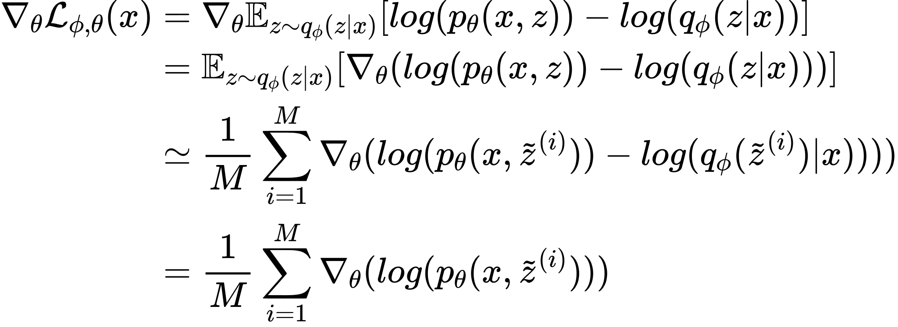
  

To clarify, the last two lines of the above derivation are utilizing simple Monte Carlo estimators.

Estimating the gradients with respect to the _variational_ parameters φ is not as simple. Above, we were able to swap the expectation with the gradient on the second line of the derivation. However when taking the gradient with respect to φ we cannot do this, since the expectation is dependant on φ as well:

<!-- $$
\begin{align*}
\nabla_\phi \mathcal{L}_{\phi, \theta} (x) &= \nabla_\phi \mathbb{E}_{z \sim q_\phi (z | x)} [log(p_\theta (x, z)) - log(q_\phi (z | x))]\\
&\neq \mathbb{E}_{z \sim q_\phi (z | x)} [\nabla_\phi (log(p_\theta (x, z)) - log(q_\phi (z | x)))]
\end{align*}
$$ --> 

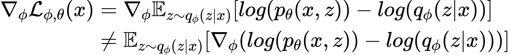
 

In order to overcome this hurdle, we utilize the _reparameterization trick_, which will allow us to compute an unbiased estimate of the gradient of the loss function with respect to _both_ the variational and model parameters:

<!-- $$
\nabla_{\phi, \theta} \mathcal{L}_{\phi, \theta} (x)
$$ --> 

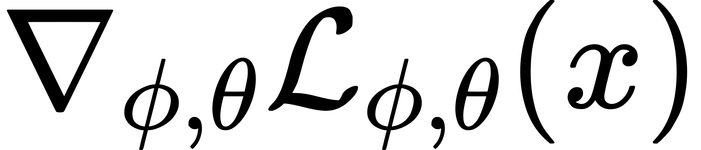
 

### Reparameterization Trick
The reparameterization trick allows us to take the gradient of the loss function with respect to both the variational and model parameters by modifying the computational tree of the variational auto encoder. Currently, the computation tree is as follows:

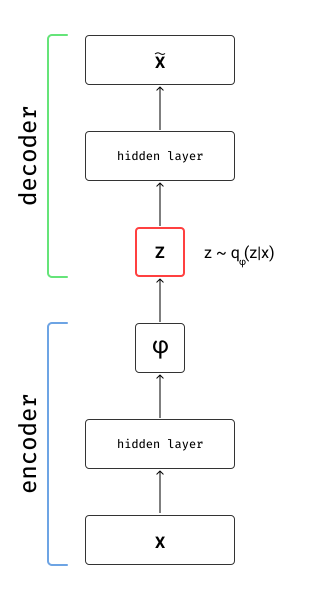

Since the latent variable 𝑧 is sampled from the distribution defined by the encoder, it is inherently noise and thus we cannot back-propagate the error signal through this node on the computational graph (hence the red coloring). In order to ameliorate this issue, we introduce the reparameterization trick, where we express 𝑧 as a function of some other random variable ε:

<!-- $$
\begin{align*}
\varepsilon &\sim p(\varepsilon)\\
z &= g_\phi (\varepsilon)
\end{align*}
$$ --> 

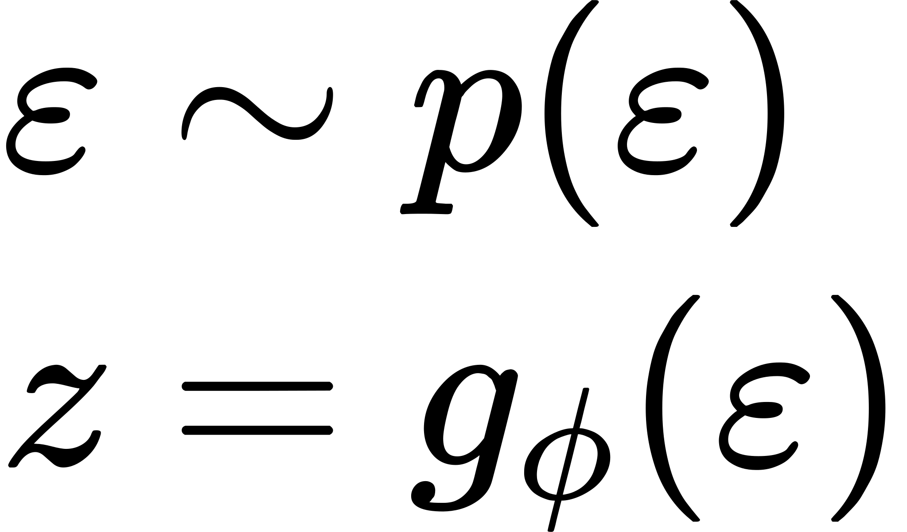
 

To make this example more concrete, if we let:

<!-- $$
\begin{align*}
\varepsilon &\sim \mathcal{N} (\varepsilon | 0, 1)\\
z &= \sigma \varepsilon + \mu\\
\Rightarrow z &\sim \mathcal{N} (z | \mu , \sigma)
\end{align*}
$$ --> 

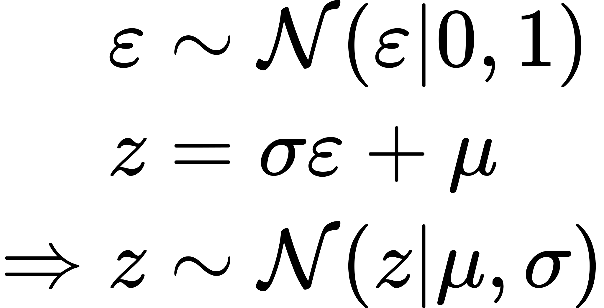

Now our computational graph has the following structure:

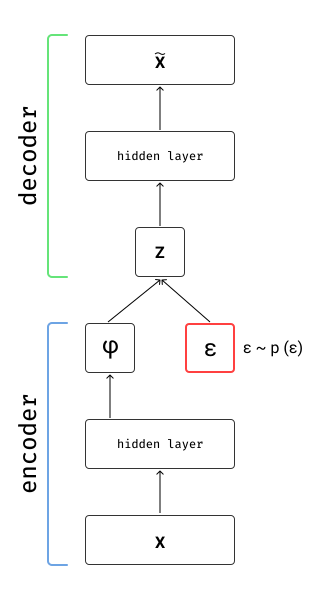

We can back-propagate the signal throughout the entirety of the model, since the source of random noise has been partitioned off into its own computational node. Finally using this trick we redefine our loss function:

<!-- $$
\begin{align*}
\varepsilon &\sim p(\varepsilon)\\
z &= g_\phi (\varepsilon)\\
\widetilde{\mathcal{L}}_{\phi, \theta} &= log(p_\theta (x, g_\phi (\varepsilon))) - log(q_\phi (g_\phi (\varepsilon) | x)
\end{align*}
$$ --> 

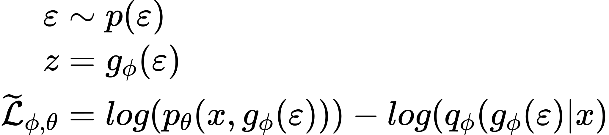
 

And then compute the unbiased estimator of our gradient with respect to both the model and variational parameters:

<!-- $$
\begin{align*}
\nabla_{\phi, \theta} \mathcal{L}_{\phi, \theta} (x) &= \nabla_{\phi, \theta} (\mathbb{E}_{\varepsilon \sim p(\varepsilon)} [log(p_\theta (x, z)) - log(q_\phi (z | x))])\\
&= \mathbb{E}_{\varepsilon \sim p(\varepsilon)} [\nabla_{\phi, \theta} (log(p_\theta (x, z)) - log(q_\phi (z | x)))]\\
&\simeq \frac{1}{M} \sum_{i=1}^{M} \nabla_{\phi, \theta} (log(p_\theta (x, g_\phi (\varepsilon^{(i)}))) - log(q_\phi (g_\phi (\varepsilon^{(i)}) | x)))
\end{align*}
$$ --> 

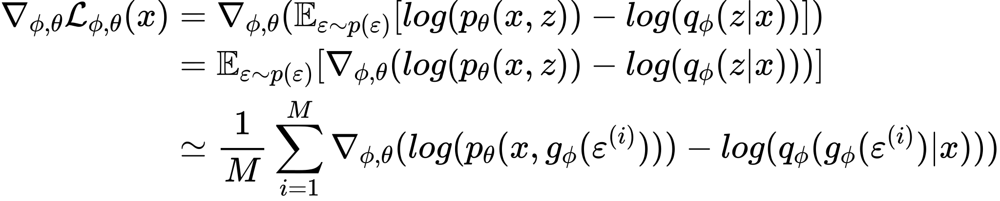
 

In conclusion, by using the reparameterization trick we are now able to back-propagate an error signal throughout the entire VAE, and thus can train the model using SGD. This concludes the lecture.

